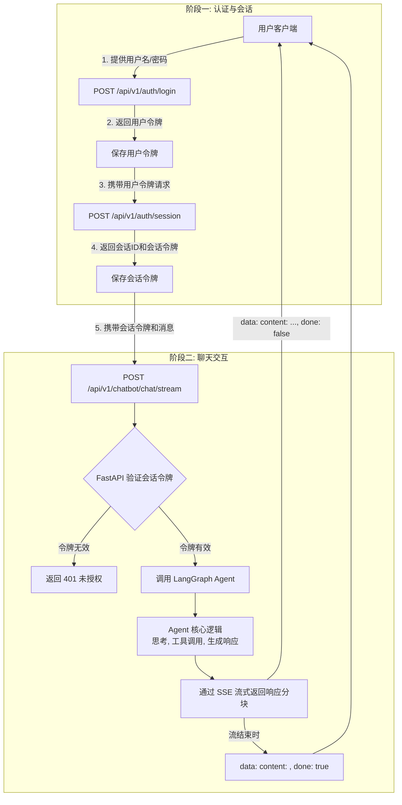

# 用户与 Agent 聊天接口调用全流程

本文档详细说明了从用户认证到与智能 Agent 进行实时聊天的完整 API 调用流程。

## 核心组件

- **认证服务 (`/api/v1/auth`)**:
  - `app/api/v1/auth.py`: 处理用户注册、登录、会话创建和令牌管理。
  - `app/utils/auth.py`: 负责 JWT 令牌的创建和验证。
- **聊天服务 (`/api/v1/chatbot`)**:
  - `app/api/v1/chatbot.py`: 提供与 Agent 交互的核心接口，包括流式和非流式聊天。
- **Agent 核心 (`LangGraph`)**:
  - `app/core/langgraph/graph.py`: 封装了 Agent 的主要业务逻辑，包括状态管理、工具调用和语言模型交互。
- **数据模型 (`schemas`)**:
  - `app/schemas/auth.py`: 定义认证相关的请求和响应体。
  - `app/schemas/chat.py`: 定义聊天相关的请求和响应体。

---

## 调用流程详解

整个流程分为两个主要阶段：
1.  **认证与会话创建**：用户登录并为一次对话创建一个唯一的会话。
2.  **发送聊天消息**：用户在该会话中与 Agent 进行交互。

### 阶段一：认证与会话创建

在与 Agent 开始聊天之前，客户端必须先获取一个代表特定聊天会话（Session）的访问令牌 (`access_token`)。

#### 步骤 0: 注册账号（可选）

如果你还没有账号，需要先完成注册。为防止未授权注册，注册接口需要在请求头中提供 `X-Auth-Token`（可通过环境变量 `REGISTRATION_AUTH_TOKEN` 配置，或向管理员索取）。

- **Endpoint**: `POST /api/v1/auth/register`
- **Headers**:
  ```
  Content-Type: application/json
  X-Auth-Token: <your_registration_token>
  ```
- **Request Body** (`application/json`):
  ```json
  {
    "email": "user@example.com",
    "password": "SecureP@ssw0rd123!"
  }
  ```
- **Response** (`200 OK`):
  ```json
  {
    "id": 1,
    "email": "user@example.com",
    "token": {
      "access_token": "eyJhbGciOiJIUzI1NiIsInR5cCI6IkpXVCJ9...",
      "token_type": "bearer",
      "expires_at": "2025-07-19T12:00:00Z"
    }
  }
  ```
- **说明**:
  - 必须提供有效的 `X-Auth-Token`，否则会返回 `401/403`。
  - 密码需满足强度要求：至少 8 位，包含大小写字母、数字与特殊字符。
  - 注册时系统会将邮箱统一转换为小写；登录时请使用小写邮箱。

##### 测试环境信息（development）

- **测试环境 X-Auth-Token**: `D3zF6r7l0b3Mmna7dhY1_YD10TcK85nUMRfKjXmRUGw`
- **测试账号**:
  - Email: `test.user@example.com`
  - Password: `SecureP@ssw0rd123!`

注册完成后，可用以下命令登录获取用户令牌：

```bash
curl -X POST "http://localhost:8000/api/v1/auth/login" \
  -H "Content-Type: application/x-www-form-urlencoded" \
  --data-urlencode "username=test.user@example.com" \
  --data-urlencode "password=SecureP@ssw0rd123!"
```

#### 步骤 1: 用户登录 (获取用户令牌)

客户端首先需要使用用户名和密码进行登录，以获取一个代表该用户的令牌。

- **Endpoint**: `POST /api/v1/auth/login`
- **Request Body** (`application/x-www-form-urlencoded`):
  ```
  username=<user_email>
  password=<user_password>
  ```
- **Response** (`200 OK`):
  ```json
  {
    "access_token": "eyJhbGciOiJIUzI1NiIsInR5cCI6IkpXVCJ9...",
    "token_type": "bearer",
    "expires_at": "2025-07-19T12:00:00Z"
  }
  ```
- **说明**: 此令牌 (`access_token`) 用于证明用户身份，在下一步中将用于创建新的聊天会话。

#### 步骤 2: 创建聊天会话 (获取会话令牌)

客户端使用上一步获得的用户令牌来创建一个新的聊天会话。每个会话都有一个唯一的 ID 和独立的上下文。

- **Endpoint**: `POST /api/v1/auth/session`
- **Headers**:
  ```
  Authorization: Bearer <user_access_token_from_step_1>
  ```
- **Response** (`200 OK`):
  ```json
  {
    "session_id": "a1b2c3d4-e5f6-7890-1234-567890abcdef",
    "name": "New Chat",
    "token": {
      "access_token": "eyJhbGciOiJIUzI1NiIsInR5cCI6IkpXVCJ9...",
      "expires_at": "2025-07-20T12:00:00Z"
    }
  }
  ```
- **说明**:
  - 响应中包含一个新的 `session_id` 和一个专用于此会话的 `access_token`。
  - **后续所有的聊天请求都必须使用这个新的会话令牌**。

---

### 阶段二：发送聊天消息

获取会话令牌后，客户端就可以开始与 Agent 进行通信了。推荐使用流式接口以获得更好的用户体验。

- **Endpoint**: `POST /api/v1/chatbot/chat/stream`
- **Headers**:
  ```
  Authorization: Bearer <session_access_token_from_phase_1_step_2>
  ```
- **Request Body** (`application/json`):
  ```json
  {
    "messages": [
      {
        "role": "user",
        "content": "你好，请问你是什么？"
      }
    ]
  }
  ```
- **Response** (`text/event-stream`):
  服务器会以 Server-Sent Events (SSE) 的形式持续返回数据块。每个事件都是一个 JSON 对象。
  ```
  data: {"content": "你", "done": false}

  data: {"content": "好，", "done": false}

  data: {"content": "我是一个", "done": false}

  data: {"content": "智能 Agent。", "done": false}

  data: {"content": "", "done": true}
  ```
- **说明**:
  - `role`: 必须是 `user` 或 `assistant`。
  - `content`: 消息的具体内容。
  - 客户端需要监听这些事件，并将 `content` 拼接起来，实时显示给用户。
  - 当接收到 `done: true` 的事件时，表示该轮对话的响应已全部发送完毕。

---

## 后端处理流程

1.  客户端携带**会话令牌**请求 `/api/v1/chatbot/chat/stream`。
2.  FastAPI 通过依赖注入调用 `get_current_session` 函数。
3.  `get_current_session` 验证 `Authorization` 头中的 JWT 令牌。
    - 如果令牌无效或过期，返回 `401 Unauthorized`。
    - 如果令牌有效，从中解析出 `session_id` 并从数据库中获取会话详情。
4.  `chat_stream` 端点函数接收到请求和会话信息。
5.  调用 `LangGraphAgent` 实例的 `get_stream_response` 方法，并传入用户的消息和 `session_id`。
6.  Agent 核心逻辑开始执行：
    - 从数据库加载该 `session_id` 的历史消息。
    - 决定是直接回复、调用工具还是向用户提问。
    - 将生成的响应内容分块 (chunk) `yield` 出来。
7.  FastAPI 将每个 `chunk` 包装成 SSE 事件格式 (`data: {...}\n\n`)，通过流式响应发送给客户端。
8.  所有内容生成完毕后，发送一个 `done: true` 的最终事件。

## 流程图

