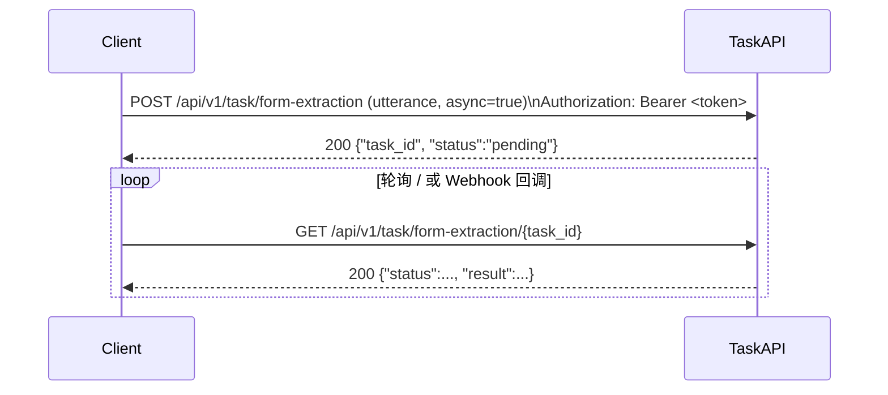

# TaskAPI —— 表单提取服务调用指南

本文档专注说明 **TaskAPI** 中“表单提取”任务的调用方式。它是一次性、无状态的 Request-Response 服务，可同步或异步执行。

---

## 1. 认证

所有请求需携带有效的 **JWT** 访问令牌：

```
Authorization: Bearer <user_access_token>
```

---

## 2. 调用流程概览

调用流程包含两个阶段：

1. 认证阶段
2. 任务阶段（提交任务 → 查询结果 / 回调）



---

## 3. API 定义

### 3.1 提交表单提取任务

- **Endpoint**：`POST /api/v1/task/form-extraction`
- **请求体** (`application/json`)

| 字段 | 类型 | 必填 | 说明 |
| ---- | ---- | ---- | ---- |
| `utterance` | string | 是 | 待解析的自然语言文本 |
| `form_code` | string | 是 | 指定表单类型，不得为空 |
| `async` | boolean | 否 | 是否异步执行，默认 `false` |
| `callback_url` | string | 否 | 异步模式下任务完成的回调地址 |

#### 同步模式示例 (`async: false`)

请求：
```json
{
  "utterance": "我要报销一张发票，金额 1234.56 元，日期 2024-07-18，发票号码 INV-2024-001。",
  "form_code": "invoice_v1"
}
```

成功响应：
```json
{
  "status": "succeeded",
  "result": {
    "InvoiceNumber": "INV-2024-001",
    "Date": "2024-07-18",
    "Amount": 1234.56
  }
}
```

#### 异步模式示例 (`async: true`, 默认)

请求：
```json
{
  "utterance": "我要报销一张发票，金额 1234.56 元，日期 2024-07-18，发票号码 INV-2024-001。",
  "form_code": "invoice_v1",
  "async": true
}
```

初始响应：
```json
{
  "task_id": "123e4567-e89b-12d3-a456-426614174000",
  "status": "pending",
  "expires_at": "2025-07-19T13:00:00Z"
}
```

### 3.2 查询任务状态 / 获取结果

- **Endpoint**：`GET /api/v1/task/form-extraction/{task_id}`

成功示例（任务完成）：
```json
{
  "task_id": "123e4567-e89b-12d3-a456-426614174000",
  "status": "succeeded",
  "result": {
    "InvoiceNumber": "INV-2024-001",
    "Date": "2024-07-18",
    "Amount": 1234.56
  }
}
```

失败示例：
```json
{
  "task_id": "123e4567-e89b-12d3-a456-426614174000",
  "status": "failed",
  "error": "无法识别金额字段"
}
```

---

## 4. 错误码

| HTTP Status | Code | 含义 |
| ----------- | ---- | ---- |
| 400 | `TASK_INVALID_REQUEST` | 参数缺失或格式错误 |
| 401 | `AUTH_INVALID_TOKEN` | 令牌无效或过期 |
| 413 | `TASK_PAYLOAD_TOO_LARGE` | 文本长度超限 |
| 429 | `TASK_RATE_LIMITED` | 触发速率限制 |
| 500 | `TASK_INTERNAL_ERROR` | 服务内部错误 |

---