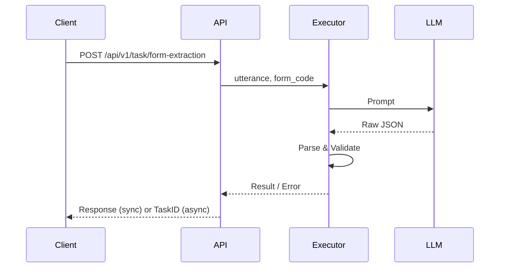

# Form Extraction 执行链设计

> 适用范围：`form_extraction` 任务的所有表单类型（包括但不限于 `hazard_report`）。

## 1. 设计目标
1. **模板可插拔**：不同表单通过 `form_code` 关联专属 Prompt 模板与后处理逻辑。
2. **统一执行链**：Prompt → LLM → JSON 解析 → Pydantic 校验 → 业务返回，全表单一致。
3. **强可观测**：链路全量接入 Langfuse，支持 Trace、Span、Prompt/Response 采样。
4. **易扩展**：新增表单只需新增模板 & Pydantic 模型，无需改动核心执行器。

## 2. 目录结构
```text
app/core/form_extraction/
├── base.py            # BaseExecutor：封装共通链路
├── registry.py        # 注册表：form_code → Prompt & Executor
├── hazard_report.py   # 专用执行器（示例）
└── templates/
    └── hazard_report.jinja2
```
> 说明：文档位于 `docs/core/`，代码位于 `app/core/form_extraction/`。

## 3. 执行链流程
| 序号 | 节点 | 说明 |
| ---- | ---- | ---- |
| 1 | **PromptNode** | 载入 Jinja2 模板，注入 `utterance` 等变量，生成最终 Prompt |
| 2 | **LLMNode** | 调用 GPT-4 系列模型，返回原始 JSON 字符串 |
| 3 | **ParseNode** | `json.loads` → Dict，如解析失败抛 `TASK_INVALID_RESPONSE` |
| 4 | **ValidateNode** | 使用对应 Pydantic 模型校验字段、默认值、条件必填规则 |
| 5 | **PostProcessNode** | 执行字段格式统一、空值标准化等后处理 |
| 6 | **ReturnNode** | 返回结果或存储到异步任务表 |

### 3.1 错误处理
| Code | 场景 |
|------|-------|
| `TASK_INVALID_REQUEST` | 参数缺失 / 格式错误 |
| `TASK_LLM_INNER_ERROR` | LLM 调用失败 |
| `TASK_INVALID_RESPONSE` | LLM 输出非合法 JSON |
| `TASK_VALIDATION_ERROR` | 字段校验失败 |
| `TASK_INTERNAL_ERROR` | 未捕获异常 |

### 3.2 可观测性
- 每个节点输出 `langfuse.trace()` span，包含：`name`、`input`、`output`、`duration_ms`。
- 关键指标在 Prometheus 暴露：`form_extraction_request_total`、`form_extraction_latency_seconds`、`form_extraction_error_total`。

## 4. 时序图


## 5. 扩展指南
1. **新增表单**：
   - 在 `templates/` 下新增 `<new_form>.jinja2` 提示词模板。
   - 新建 `<new_form>.py`，继承 `BaseExecutor` 实现特有后处理或校验。
   - 在 `registry.py` 注册：`registry.register("<new_form>", ExecutorClass)`。
2. **字段模型**：使用 Pydantic 定义，全字段需包含：默认值、枚举限定、条件必填逻辑（`root_validator`）。
3. **版本管理**：若表单升级，推荐新增版本化 `form_code`（如 `invoice_v2`），保证向后兼容。 