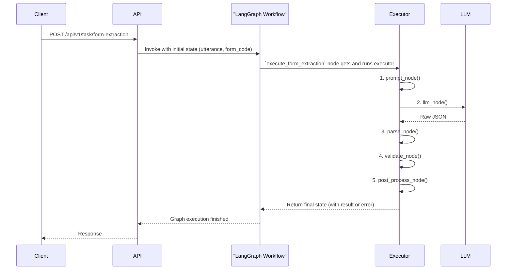

# Form Extraction 执行链设计

> 适用范围：`form_extraction` 任务的所有表单类型（包括但不限于 `hazard_report`）。

## 1. 设计目标
1. **模板可插拔**：不同表单通过 `form_code` 关联专属 Prompt 模板与后处理逻辑。
2. **统一执行链**：Prompt → LLM → JSON 解析 → Pydantic 校验 → 业务返回，全表单一致。
3. **易扩展**：新增表单只需新增模板 & Pydantic 模型，无需改动核心执行器。

## 2. 目录结构
```text
app/core/form_extraction/
├── __init__.py        # 包初始化，导出关键组件
├── base.py            # 定义 BaseExecutor (执行器基类) 和 FormExtractionState (状态)
├── registry.py        # 注册表：管理 form_code 到 Executor 类的映射
├── graph.py           # LangGraph 工作流编排与执行
├── hazard_report.py   # 'hazard_report' 表单的具体实现（示例）
└── templates/
    └── hazard_report.jinja2 # 'hazard_report' 的 Jinja2 提示词模板
```
> 说明：文档位于 `docs/core/`，代码位于 `app/core/form_extraction/`。

## 3. 执行流程
`form_extraction` 的核心是一个由 `graph.py` 定义的 LangGraph 工作流。当工作流被调用时，其核心节点 `execute_form_extraction` 会从 `registry` 中获取对应 `form_code` 的 `Executor` 实例，并依次调用该实例的一系列方法，形成一条标准化的处理管线：

1.  **`prompt_node`**: 根据 `templates/` 中的 Jinja2 模板和用户输入 (`utterance`) 生成最终的 Prompt。
2.  **`llm_node`**: 调用大语言模型（如 GPT-4），获取返回的、期望为 JSON 格式的字符串。
3.  **`parse_node`**: 将 LLM 返回的字符串解析为 Python 字典。如果解析失败（非合法 JSON），则写入 `TASK_INVALID_RESPONSE` 错误码。
4.  **`validate_node`**: 使用与表单对应的 Pydantic 模型对解析出的字典进行严格的类型、格式和业务规则校验。
5.  **`post_process_node`**: 对已验证通过的数据进行最后的清洗、格式化或转换。
6.  **结果处理**: 工作流根据执行过程中是否产生 `error_code`，将最终结果或错误信息存入 State 中，然后结束。

### 3.1 错误处理
| Code | 场景 |
|------|-------|
| `TASK_INVALID_REQUEST` | 启动参数缺失 / `form_code` 未注册 |
| `TASK_LLM_INNER_ERROR` | LLM 服务调用失败 |
| `TASK_INVALID_RESPONSE` | LLM 输出的不是合法的 JSON |
| `TASK_VALIDATION_ERROR` | 业务字段校验失败（Pydantic） |
| `TASK_INTERNAL_ERROR` | 其他未捕获的内部异常 |

## 4. 时序图


## 5. 扩展指南
1.  **新增模板**：在 `templates/` 目录下新增一个 `<new_form>.jinja2` 提示词模板。
2.  **新增实现**：在 `app/core/form_extraction/` 下新建一个 `<new_form>.py` 文件。
    -   在其中定义一个继承自 `BaseExecutor` 的新 Executor 类。
    -   定义一个继承自 `pydantic.BaseModel` 的新 Model 类，用于数据校验。
3.  **注册服务**：打开 `app/core/form_extraction/__init__.py`，导入并注册你的新 Executor。
4.  **字段模型**：设计 Pydantic 模型时，应充分利用其特性定义所有字段的校验规则，包括默认值、枚举限定（`Literal` 或 `Enum`）、以及使用 `@field_validator` 和 `@model_validator` 实现复杂的字段和模型级别校验。
5.  **版本管理**：若表单业务逻辑发生重大变化，推荐新增一个版本化的 `form_code`（例如 `invoice_v2`），而不是直接修改旧的实现，以保证向后兼容。 

## 6. 高级特性与最佳实践

### 6.1 统一 State 数据结构
在 LangGraph 中，所有节点共享同一个状态对象 `FormExtractionState` (`TypedDict`)。这带来了几个好处：
1.  **类型安全**：在开发过程中提供静态类型检查和代码提示。
2.  **调试便利**：在任何节点中断时，都可以通过检查 State 对象来获取完整的执行上下文。

`FormExtractionState` 的结构与 `base.py` 中定义的一致：
```python
from typing import Any, Dict, Optional, TypedDict

class FormExtractionState(TypedDict):
    """State for form extraction workflow."""
    utterance: str                     # 原始用户输入
    form_code: str                     # 表单标识码
    prompt: Optional[str]              # 生成的提示词
    raw_json: Optional[str]            # LLM返回的原始JSON字符串
    data: Optional[Dict[str, Any]]     # 解析后的数据字典
    validated_data: Optional[Dict[str, Any]] # 校验后的数据
    result: Optional[Dict[str, Any]]       # 最终结果
    error_code: Optional[str]          # 错误码 (见 3.1)
    error_message: Optional[str]       # 详细错误信息
```
每个处理方法（如 `parse_node`）只应读写自己负责的字段，以保证职责单一。

### 6.2 显式错误路由
我们推荐通过在 State 中设置错误码，并利用 LangGraph 的**条件边（Conditional Edges）**来进行显式错误处理，而不是在执行链中直接抛出异常。

**工作原理**：
1.  `BaseExecutor` 的任何一个方法（如 `parse_node`）在遇到问题时，不 `raise` 异常，而是将错误信息写入 State 的 `error_code` 和 `error_message` 字段。
2.  在 `graph.py` 中，核心的 `execute` 节点执行完毕后，一条条件边会检查 State 中是否存在 `error_code`。
3.  如果存在 `error_code`，工作流将被路由到统一的 `error_handler` 节点进行处理；否则，流向 `success_handler` 节点。

这种方式的优点是：
- **链路清晰**：从 Trace 中可以清晰地看到完整的执行路径，包括错误是如何发生并被处理的。
- **易于监控**：可以方便地在 `error_handler` 节点中添加统一的日志、告警或指标上报逻辑。